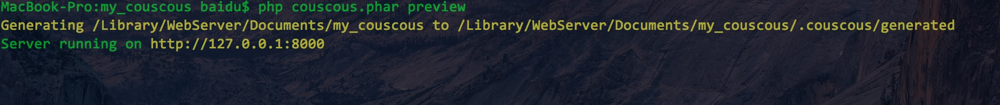
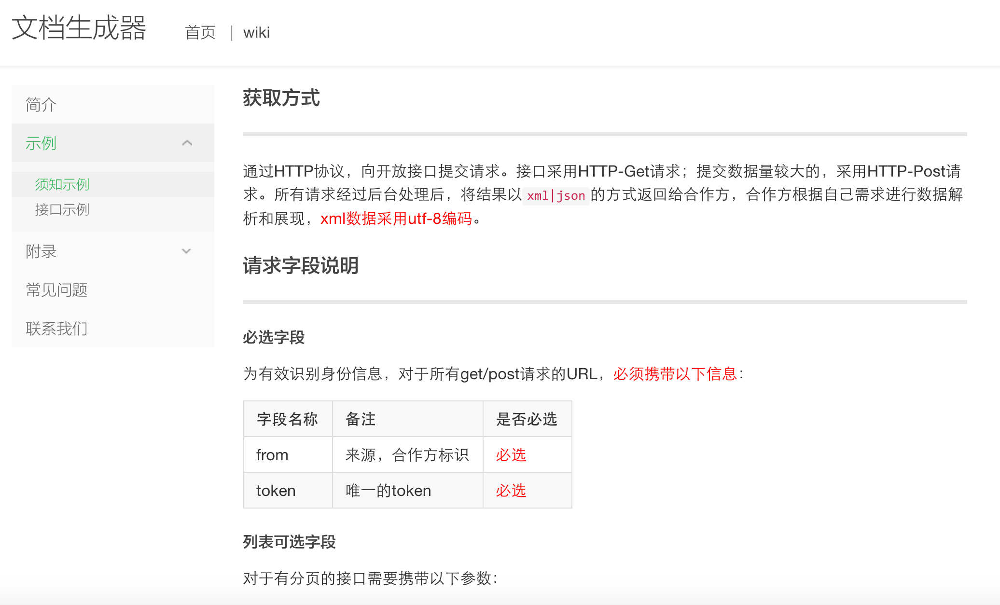

# markdown to html 文档生成器
书写对外接口说明的markdown文档，使用php执行扩展，会生成html网站；适合对外的接口文档输出；

 * 友情链接 [mac|linux使用手册](https://echooly.gitbooks.io/mac-linux/content/)：该文档是使用gitbook生成，gitbook也是一个书写文档的很好的选择；

## 使用说明
### 全局配置
首先配置 `couscous.yml` 文件，即配置文档输出的菜单、标题、模板等信息；如：
```angular2html
template:
    directory: .

github:
    user: yptangecho@163.com
    repo: echooly

keywords: 文档手册
description: 写文档从此快乐
title: 文档生成器
subTitle: An amazing template for Couscous.
baseUrl: https://echooly.github.com/my_couscous

# The header menu
header:
    items:
        index:
            text: 首页
            # You can use relative urls
            relativeUrl: index.html
        wiki:
            text: wiki
            # Or absolute urls
            #absoluteUrl: http://couscous.io
            relativeUrl: ./docs/intro/desc.html

# The left menu bar
menu:
    items:
        desc:
            text: 简介
            relativeUrl: ./docs/intro/desc.html
        interface:
            text: 示例
            items:
                api:
                    text: 须知示例
                    relativeUrl: ./docs/intro/api.html
                board:
                    text: 接口示例
                    relativeUrl: ./docs/intro/board.html
        store:
            text: 存储
            items:
                redis:
                    text: redis
                    relativeUrl: ./docs/store/redis.html
        extrainfo:
            text: 附录
            items:
                extrainfo1:
                    text: 附录1
                    relativeUrl: ./docs/intro/extrainfo.html
        question:
            text: 常见问题
            relativeUrl: ./docs/intro/question.html
        about:
            text: 联系我们
            relativeUrl: ./docs/intro/about.html
```
- 配置项[详细说明](./tips.md)

### 生成html网站

1. curl -OS http://couscous.io/couscous.phar， 如果项目中已经存在不需要该操作
1. php couscous.phar preview (deploy发布到gh-page)

1. 编辑`couscous.yml`，自定义页面模板`default.twig`,编辑markdown文件。（示例已经存在）
1. 将在.couscous/generated下生产html
1. 浏览器中预览：`http://127.0.0.1:8000/`；如果报错，删除.couscous/ 即rm -rf .couscous


## 下载地址
https://github.com/echoOly/my_couscous

## 预览

   * [欢迎在线体验](http://docs.9aipay.com/)
   * 效果如下：
   


## 如有疑问
qq群：15717867

## 支持我们

- 微信


- 支付宝

